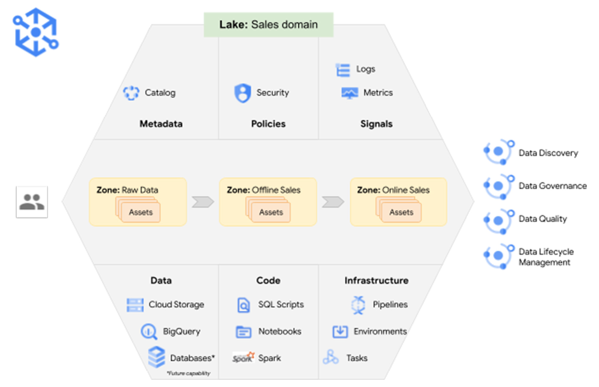

# 📚 Relatório de Estudos

**Nome do Estagiário:** Pablo Vinícius Domingues Sanches  
**Data de Início:** 09/10/2024  

---

## 📑 Conteúdo:

- [**Governança de Dados**](#gdados)
- [**Dataplex**](#dtplex)
- [**Data Catalog**](#dtlog)
- [**Laboratórios**](#labs)

---

## 1. Governança de Dados 

Governança de dados refere-se à definição de políticas e padrões internos para gerenciar como os dados são coletados, armazenados, processados e descartados. Ela garante controle sobre o acesso e uso dos dados, assegurando que sejam seguros, privados, precisos, disponíveis e utilizáveis.

> O principal objetivo da governança de dados é garantir que os dados estejam acessíveis, seguros, de alta qualidade e usados de maneira eficiente e ética. 

### **1.1 Qualidade de Dados** 

A qualidade de dados assegura que os dados sejam precisos, completos, consistentes e confiáveis. Ferramentas de qualidade de dados ajudam a identificar e corrigir erros ou inconsistências.

### **1.2 Segurança de Dados** 

Assegura que os dados estejam protegidos contra acessos não autorizados e violações. Isso envolve:

- **`Controle de Acesso:`** Definir quem tem permissão para visualizar, editar ou excluir dados.
- **`Criptografia:`** Proteger dados sensíveis, tanto em trânsito quanto em repouso.

### **1.3 Conformidade e Regulamentações** 

Garantir que os dados sejam gerenciados em conformidade com regulamentações como:

- **`LGPD:`** Proteção de dados pessoais.
- **`SOX:`** Leis para garantir integridade financeira.

### **1.4 Catálogo de Dados** 

Criação de um catálogo que documenta onde estão os dados, como estão estruturados e quem é o responsável por eles. Isso facilita a descoberta e reutilização de dados dentro da organização.

### **1.5 Auditoria e Monitoramento** 

Registro de todas as ações relacionadas aos dados (quem acessou, alterou, excluiu). Esse rastreamento é fundamental para a conformidade com regulamentos e para a detecção de comportamentos anômalos.

### **1.6 Gerenciamento do Ciclo de Vida dos Dados** 

Definir o ciclo de vida dos dados, desde sua criação e armazenamento até sua eventual exclusão ou arquivamento. Isso evita o acúmulo de dados irrelevantes ou obsoletos.

---

## 2. **Dataplex** 

O Google Dataplex é uma solução na Google Cloud para governança de dados distribuídos. Ele simplifica a organização, segurança e descoberta de dados em ambientes **multicloud** e **on-premises**. Dataplex combina governança, integração e automação para facilitar o gerenciamento de dados em grande escala.

> - **🌩️ Multicloud:** Refere-se ao uso de mais de uma plataforma de computação em nuvem para diferentes serviços, aplicações ou tarefas dentro de uma mesma organização.

> - **🏢 On-premises:** Refere-se a uma infraestrutura de TI que é mantida localmente, dentro das instalações da empresa, onde servidores, sistemas e dados são gerenciados fisicamente. 

### **2.1 Lakes** 

Um Data Lake no Dataplex é uma coleção de dados armazenada em diferentes formas (estruturados e não estruturados) dentro de um ambiente centralizado, geralmente usando o Cloud Storage. O conceito de lake no Dataplex é amplamente utilizado para referenciar áreas de armazenamento de dados brutos, que podem ser usados para análise posterior.

### **2.2 Zones** 

As **Zones** são subcomponentes dentro de um **Lake** no Dataplex, representando áreas lógicas para organizar dados de acordo com critérios como:

- **`Raw Zone:`** Dados brutos, sem processamento.
- **`Curated Zone:`** Dados refinados e preparados para uso analítico.

### **2.3 Assets** 

Os **Assets** são as unidades de dados gerenciadas dentro de uma **Zone**, podendo incluir datasets do BigQuery, buckets no Cloud Storage ou tabelas que são registradas no Dataplex para governança e análise.

O Dataplex facilita a análise de dados com ferramentas nativas do GCP, como BigQuery, e fornece uma camada de abstração para simplificar o acesso aos dados.

## 3. **Data Catalog** 
O Data Catalog é um serviço de gerenciamento de metadados totalmente gerenciado e escalável dentro do Dataplex que você pode usar para marcar ativos de dados e pesquisar ativos aos quais você tem acesso. As tags permitem que você anexe campos de metadados personalizados a ativos de dados específicos para fácil identificação e recuperação (como marcar certos ativos como contendo dados protegidos ou confidenciais); você também pode criar modelos de tags reutilizáveis ​​para atribuir rapidamente as mesmas tags a diferentes ativos de dados.

### **3.1 Tags** 
No Google Dataplex, tags são metadados que podem ser usados para descrever e categorizar dados. Elas servem como uma camada adicional de informações, facilitando a governança e o gerenciamento dos dados em um Data Lake. As tags ajudam a organizar, classificar e identificar dados de forma mais eficiente, além de melhorar a busca, a análise e a aplicação de políticas de segurança e governança. 

As **tags** no Dataplex são aplicadas aos assets (como datasets ou tabelas no BigQuery, buckets no Cloud Storage) e ajudam a identificar atributos específicos dos dados. Cada tag pode ter um conjunto de atributos que definem propriedades como:
 
 

- `Tipo de Dado:` Pode ser usado para indicar se o dado é estruturado, semiestruturado ou não estruturado.  

- `Sensibilidade:` Para indicar o nível de sensibilidade dos dados, como se eles contêm informações pessoais ou dados confidenciais. 

- `Fonte:` Identificar a origem dos dados, como se eles vêm de sistemas de CRM, ERPs, ou redes sociais. 

 

### **3.1.1 Modelo de Tags**
Quando você marca uma tabela com tags no Data Catalog, isso permite que você associe metadados customizados à tabela, ajudando a melhorar a organização, busca e governança dos dados.  
- `Classificação e Organização:`As tags facilitam a categorização de recursos no Data Catalog, ajudando a identificar rapidamente o propósito ou a sensibilidade de uma tabela, como "Confidencial", "Financeira", ou "Pública".  
- `Busca Melhorada:` As tags são pesquisáveis. Ao procurar por um tipo específico de dado ou recurso no Data Catalog, as tags associadas à tabela aparecem nos resultados da busca, tornando mais fácil localizar tabelas específicas.  
- `Políticas de Governança:` Tags podem ser usadas para aplicar políticas de governança, como controle de acesso, auditoria e conformidade. Por exemplo, você pode usar tags para classificar dados sensíveis e aplicar políticas de segurança ou retenção específicas a essas tabelas.  
- `Data Lineage:` O uso de tags pode ajudar no rastreamento do lineage (linhagem de dados), fornecendo contexto sobre a origem e o fluxo dos dados entre diferentes sistemas.  
- `Automatização de Processos:` Algumas automações podem ser configuradas com base em tags. Por exemplo, você pode criar.

### **3.1.2 Tags de Governança**
>São usadas para aplicar políticas de acesso, conformidade e segurança a dados em diferentes assets (datasets, tabelas, arquivos).
Por exemplo, você pode aplicar uma tag para indicar que certos dados são sensíveis ou que precisam cumprir com regulações como a LGPD ou SOX.

### **3.1.3 Tags Personalizadas**
>São criadas pelo próprio usuário para categorizar os dados de acordo com as necessidades do negócio.
Você pode usar essas tags para identificar diferentes tipos de datasets, como dados de vendas, marketing ou recursos humanos.

 alertas ou executar processos automáticos quando uma tabela marcada com uma tag específica for acessada ou modificada.

 
 

## 🔗 Links de Laboratórios

- https://www.cloudskillsboost.google/course_templates/726?catalog_rank=%7B%22rank%22%3A1%2C%22num_filters%22%3A1%2C%22has_search%22%3Atrue%7D&search_id=37620328

- https://www.cloudskillsboost.google/focuses/11037?locale=pt_BR&parent=catalog

---

## **🛠️ Recursos Utilizados:**  

### 📄 Documentos:
- https://github.com/2RP-Squad404/Cloud_Strike/tree/develop/relatorios
- https://cloud.google.com/dataplex?hl=pt-BR
- https://cloud.google.com/data-catalog/docs

### 🎥 Vídeos:
- https://youtu.be/Gf_0cqJ4psA?si=RYk__E0acZmlRlp8
- https://youtu.be/eRzx4VSjAXg?si=RZCbz6niLiyEMrf4
- https://youtu.be/_4NjYHOLa6U?si=3YKmGuIV6NRvMWAr

