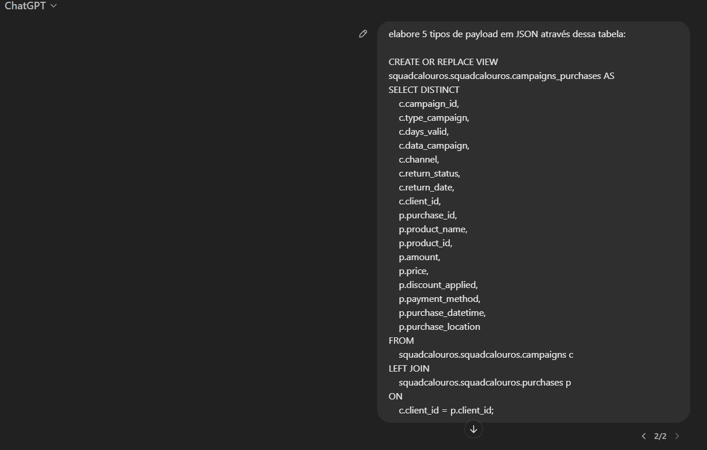
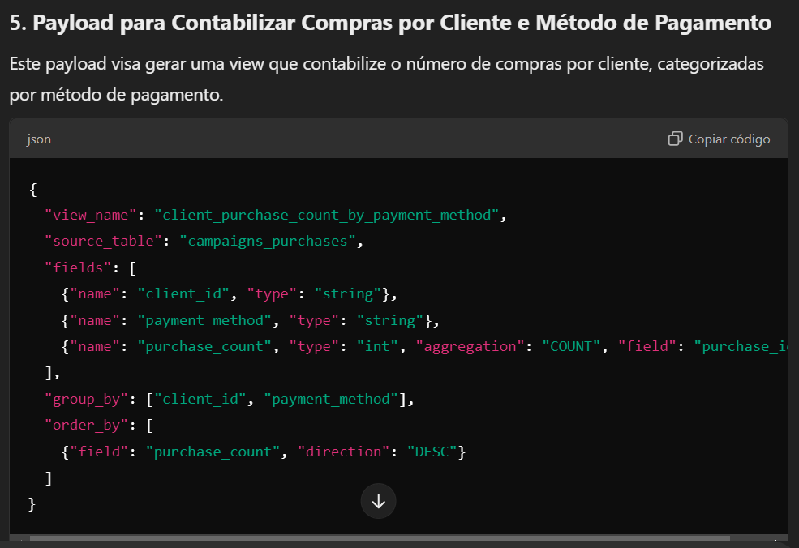
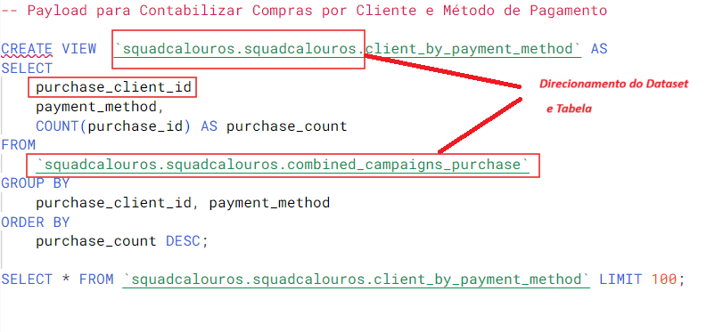

**Nome do Estagiário:** Pablo Vinícius Domingues Sanches  
**Data:** 13/09/2024

# **GenIA, Payloads e Views**

### **Geração de payloads**
Com o ChatGPT, solicitei a criação de payloads JSON de acordo com a tabela/view ***combined_campaigns_purchasea***. Foram através desses payloads gerados que surgiu a possibilidade de trabalha-los no Vertex AI. 

 

--------------

- **Exemplo de payload gerado**

--------------

### **Vertex AI**
No Vertex AI, foi onde foram trabalhados os payloads para a criação de views como scripts SQLX.  
Ao solicitar a criação de views com os payloads referenciados, os resultados atenderam as expectativas.

--------------

### **BigQuery**

Feita as views, o próximo passo seria implementa-las ao BigQuery.  
  
Ao adicionar a view(script) gerado pelo Vertex AI, foi necessáio alguma mudanças:

 

- Alterar os direcionamentos: adicionando os caminhos de dataset e tabela;
- Modificar  client_id: especificando para tabela  purchase.

 

# **Dúvidas**
- Referente ao passo a passo (instruções do projeto);
