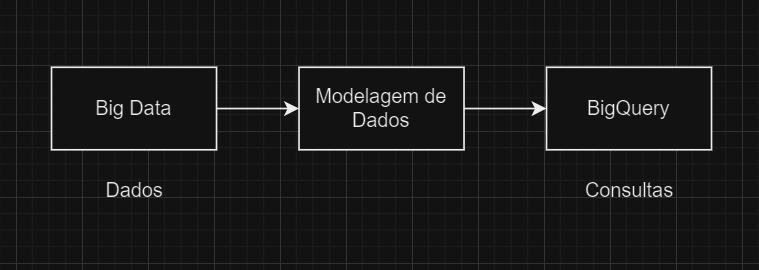

# Relatório de Estudos

**Nome do Estagiário:** Pablo Vinícius Domingues Sanches  
**Data:** 09/08/2024

**Módulos/Etapas Feitas:**  
1. **Git**
2. **Mensageria**
3. **BigQuery**

 

## Resumo dos módulos 

 # **1. Git - Comandos**
 - `git stash` - Usado para salvar temporariamente as alterações não comitadas em um repositório, permitindo que você limpe seu diretório de trabalho sem perder essas modificações.  
 Isso é útil quando você precisa mudar de branch ou realizar outras operações sem querer fazer um commit das alterações atuais.

 - `git revert` - Usado para desfazer as alterações de um commit específico, criando um novo commit que reverte as mudanças feitas no commit original.  
  Isso é útil quando você deseja desfazer alterações sem alterar o histórico do repositório.

### **1.2 Merge e Rebase**
Tanto o merge quanto o rebase têm a mesma função básica de integrar mudanças de diferentes branches no Git. No entanto, eles fazem isso de maneiras diferentes, resultando em estruturas de histórico distintas.

 - `git merge` - Utilizado quando quiser preservar o histórico completo e não se importar com uma árvore de commits mais complexa.

 - `git rebase` - Utilizado quando quiser um histórico mais limpo e linear, especialmente antes de mesclar mudanças em uma branch principal.

 ### **1.3 Fork**
 Fork no GitHub é uma cópia de um repositório que permite que você faça alterações sem afetar o repositório original. É uma maneira de contribuir para projetos, experimentar novas ideias ou personalizar um projeto existente. 

 ### **1.4 Pull request**
Um pull request é uma solicitação para mesclar alterações feitas em um branch de um repositório para outra branch, geralmente para a branch principal.

 

 # **2. Mensageria**
Mensageria é o envio e recebimento de mensagens entre sistemas ou usuários. É amplamente utilizada em aplicações de comunicação, como chats, notificações e integrações entre serviços. 

### **2.1 Assíncrona**
→ Permite que as mensagens sejam enviadas e recebidas em tempos diferentes, sem necessidade de resposta imediata.

### **2.2 Síncrona**
→ Exige que o remetente e o destinatário estejam online ao mesmo tempo (interação em tempo real).

### **2.3 Tipos**
- **Pub/Sub:** Modelo cujo permite que um componente (publicador) envie mensagens para um tópico, e os componentes interessados (assinantes) recebem essas mensagens. É útil para disseminar informações para múltiplos consumidores simultaneamente. 

- **Fila de Mensagens:** As mensagens são armazenadas em uma fila e processadas por consumidores. Este modelo é um caracterizado como assíncrono, utilizada para garantir a distribuir a carga entre múltiplos consumidores e a ordem de processamento das mensagens. 

- **Mensagem de Ponto a Ponto:**  Refere-se à troca direta de mensagens entre dois componentes sem a necessidade de intermediários. Nesse modelo, as mensagens são enviadas diretamente de um ponto inicial para um ponto final, sem passar por um sistema intermediário de mensageria. 

 # **3. BigQuery**
Em suma, BigQuery é um serviço de Big Data da Google onde é possível armazenar seus dados no próprio servudor da Google.

O processo do BigQuery pode ser separado em três etapas - Armazenamento, ingestão e consulta.

 
 
## **Recursos Utilizados:**  

- Curso Udemy - Git e GitHub para inciantes (https://www.udemy.com/course/git-e-github-para-iniciantes/learn/lecture/5120580#reviews)
- GitMind (https://gitmind.com/app/docs/mokn7z35)
- VS Code
- Git & GitHub

 

**Desafios Encontrados:**  
Para os estudos, tive dificuldade nas pesquisas dos temas e módulos por conta do sinal instavél de internet.

**Feedback e Ajustes:**  
No momento, não tenho nenhum feeedback para comentar. 

**Próximos Passos:**  
Irei continuar meu estudo e pesquisa no módulo de BigQuery, assim como também vou revisar tópicos de big data e mensageria.

