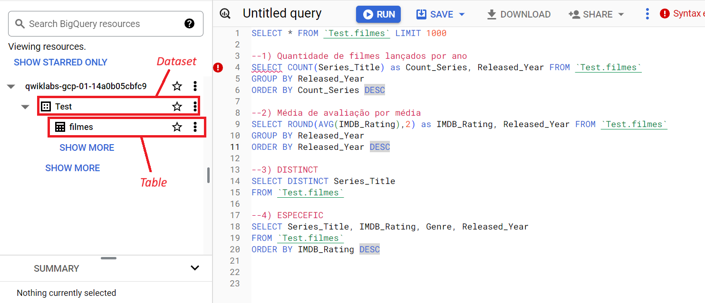
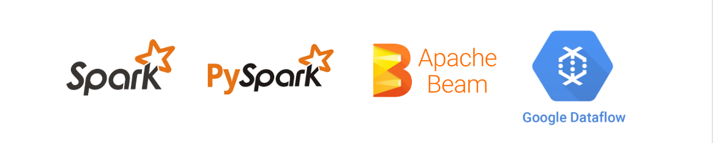
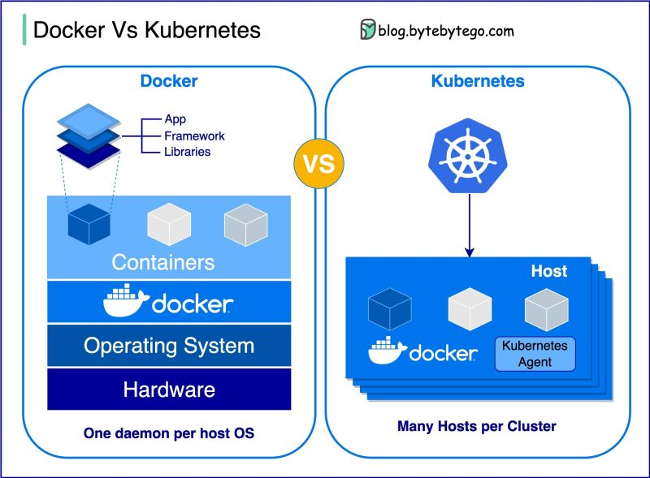

# Relatório de Estudos

**Nome do Estagiário:** Pablo Vinícius Domingues Sanches  
**Data:** 14/08/2024

**Módulos/Etapas Feitas:**  
[**1. Analítico**](#analitico)  
[**2. BigQuery**](#query) 
[**3. Linguagens e Frameworks**](#linguagens) 
[**4. Virtualização**](#vms)

 

## Resumo dos módulos 

# **1. Analítico **
São nas bases analíticas que ocorre o tratamento do big data, todos aqueles conjuntos de dados volumosos e complexos são organizados atrevés de **data werehouses** e **data lakes**, onde através das ferramentas analíticas e consultas dá-se as extrações de insights valiosos. Tecnologias como BigQuery e ApacheSpark são exemplos de ferramentas utilizadas em bases analíticas. 

### **1.1 Data werehouse**
É um sistema projetado para armazenar dados estruturados e organizados, eficientes para análises e relatórios. É ideal para tomada de decisões empresariais.

### **1.2 Data lake**
Um repositório que permite armazenar dados em sua forma bruta e original, abrigando tanto dados estruturados quanto não estruturados. É mais flexível para manipulação de big data. 

 

# **2. BigQuery**
Através das ferramentas do Google Cloud BigQuery pude praticar algumas comsultas em SQL. Realizei estudos em três dadasets:

- Covid-19 Global Dataset;
- Coronavírus Brasil Dataset;
- IMDb Dataset

Sendo todos eles em formato arquivo.csv.
 

### **2.1 Consultas**
Utilizando a tabela de dados retirada do dataset IMDb, site de valiação de filmes e séries, foi possível filtrar algumas informações com os dados disponíveis: 

 

# **3. Linguagens - Python**
Python é uma linguagem de programação de alto nível, conhecida por sua sintaxe simples e legível, que facilita a leitura e a escrita do código. Ela possui tipagem dinâmica, o que significa que não é necessário declarar tipos de variáveis, pois eles são inferidos automaticamente. Python também oferece uma vasta gama de bibliotecas e frameworks. 

# **4. Frameworks**
Frameworks são conjuntos de ferramentas e bibliotecas que facilitam o desenvolvimento de aplicações, fornecendo uma estrutura padrão e reutilizável. Em Python, eles são usados para acelerar o processo de desenvolvimento, permitindo que os programadores se concentrem na lógica do negócio em vez de se preocuparem com detalhes de implementação.

### **4.1 Apache Spark**
Conhecido por sua capacidade de processar grandes volumes de dados de forma distribuída e em memória, Apache Spark é um frameworkd de processamento de big data, **open-source**, projetado para processamento rápido e geral. 

- **open-source:** Refere-se a um modelo de desenvolvimento de software em que o código-fonte é disponibilizado publicamente. 

### **4.2 PySpark**
OPySpark é a interface do Apache Spark para a linguagem de programação Python. Essa integração permite que os desenvolvedores aproveitem a robusta engine de processamento de dados do Spark, utilizando a sintaxe e as bibliotecas familiares do Python.

 

# **5. Virtualização**
A virtualização é uma tecnologia que permite criar versões virtuais de recursos físicos, como servidores, sistemas operacionais, dispositivos de armazenamento e redes. 

### **5.1 VMs**
Máquinas Virtuais (VMs) são representações virtuais de computadores físicos que operam em um ambiente de software. Elas permitem que múltiplos sistemas operacionais e aplicativos sejam executados ao mesmo tempo em um único conjunto de hardware, otimizando o uso dos recursos disponíveis e proporcionando flexibilidade e isolamento entre diferentes ambientes de execução.
___
### **5.2 Docker** 
Plataforma de software que permite criar, implantar e gerenciar aplicações em contêineres. Sendo os containers ambientes isolados que contêm tudo o que um aplicativo precisa para funcionar, incluindo o código, as bibliotecas e as dependências, garantindo que ele funcione de maneira consistente em diferentes ambientes.

### **5.2.1 Docker File**
Um Dockerfile é um arquivo de texto que contém uma série de comandos e instruções que o Docker usa para construir uma imagem. 
### **5.2.2 Docker Compose**
Docker Compose é uma ferramenta para definir e executar aplicativos Docker multi-contêineres. Ele permite que você configure todos os serviços do seu aplicativo (contêineres) em um único arquivo e os gerencie coletivamente com um único comando.
___
### **5.3 Kubernetes**
Kubernetes é uma plataforma de orquestração de contêineres de código aberto que automatiza a implantação, o dimensionamento e o gerenciamento de aplicativos em contêineres.

### **5.4 Docker x Kubernetes**
Tanto o **Kubernetes** quanto o **Docker** são tecnologias de contêiner. As aplicações modernas são formadas por microsserviços, ou seja, componentes independentes que executam cada processo de aplicação como um serviço. Cada serviço executa uma única função e se comunica com outros serviços por meio de uma interface bem definida chamada de API. A conteinerização fornece a ferramenta de software para empacotar microsserviços como programas implantáveis em diferentes plataformas.

 

**Docker:** O Docker é uma tecnologia de tempo de execução de contêineres que permite criar, testar e implantar aplicações mais rapidamente do que os métodos tradicionais.

**Kubernetes:** O Kubernetes é uma ferramenta de orquestração de contêineres que permite escalar seus sistemas de contêineres, para que você possa gerenciar, coordenar e programar contêineres em grande escala.
___

### **5.4 VMs x Docker**
O Docker e as máquinas virtuais (VMs) têm abordagens diferentes para virtualização. O Docker é mais leve, pois os containers compartilham o núcleo do sistema operacional, enquanto as VMs precisam de um sistema operacional completo, tornando-as mais pesadas. Isso resulta em tempos de inicialização mais rápidos para containers, que podem ser iniciados em segundos, enquanto as VMs podem levar minutos. 
 

 
O isolamento entre contêineres, embora menos robusto do que o das máquinas virtuais, permite que aplicações diferentes sejam executadas no mesmo host sem interferência. Isso contribui para a consistência, já que o ambiente de execução permanece o mesmo em todas as etapas do ciclo de vida da aplicação, reduzindo problemas de "funciona na minha máquina".

Docker também facilita a escalabilidade horizontal, permitindo que múltiplas instâncias de contêineres sejam executadas simultaneamente. 
___

## **Recursos Utilizados:**  

- GitMind (https://gitmind.com/app/docs/mokn7z35)
- Datasets:
- 1. (https://www.kaggle.com/datasets/lakshmi25npathi/imdb-dataset-of-50k-movie-reviews)
- 2. (https://www.kaggle.com/datasets/josephassaker/covid19-global-dataset)
- 3. (https://covid.saude.gov.br/)
- Curso/Playlist Google Big Query - Google Cloud (https://youtu.be/tsJrsgSIoPo?si=b4WBNZsYQEUXzVsu)
- Vídeo Big Query (https://youtu.be/pMXk1-LHHQM?si=iF-FtV2SxWxNG7bo)
- Curso Docker Essencial: Primeiros Passos - TechEduca (https://youtu.be/OERbOJZwGAU?si=N0vsUhiHL-xozcC5)
- VS Code
- Git & GitHub

 

**Desafios Encontrados:**  
Acredito que o único e breve desafio encontrado foi alinhar quais seriam as prioridades dos temas de estudos.

**Feedback e Ajustes:**  
No momento, sem feedback para adiconar e sugestão de ajustes.

**Próximos Passos:**  
Em breve, focarei meus estudos nos frameworks e ferramentas do docker e coloca-las em práticas.

