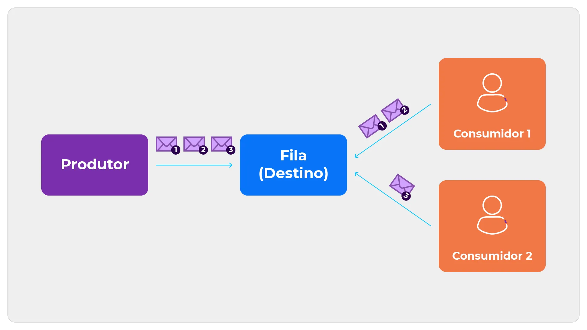
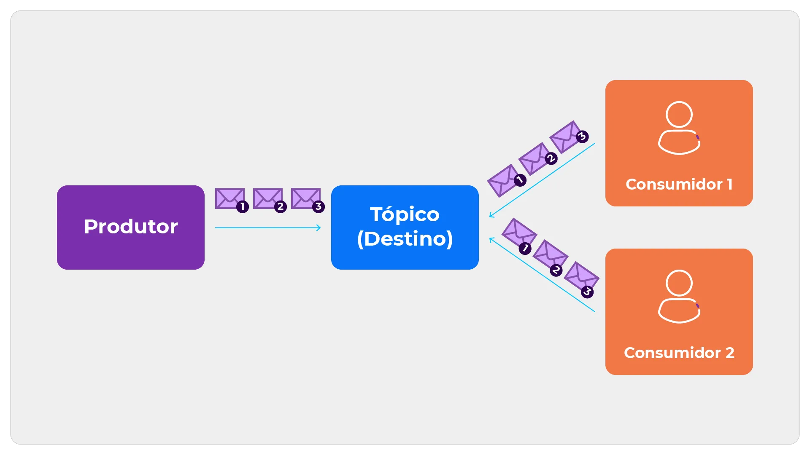
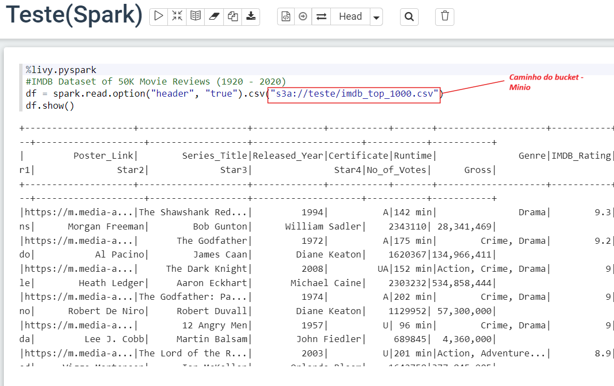
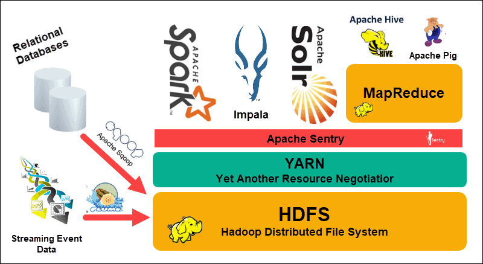
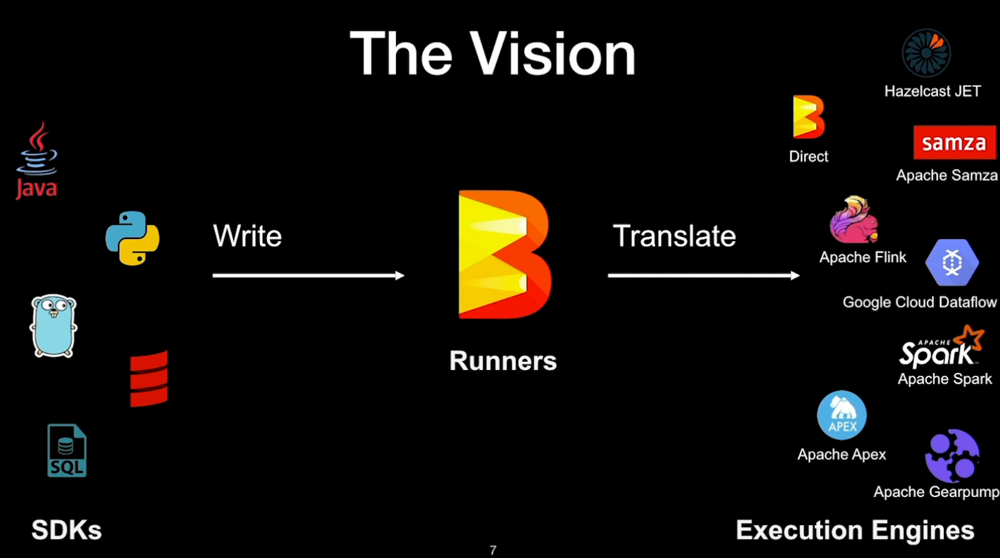
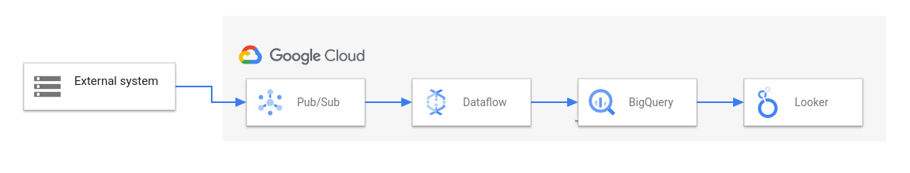
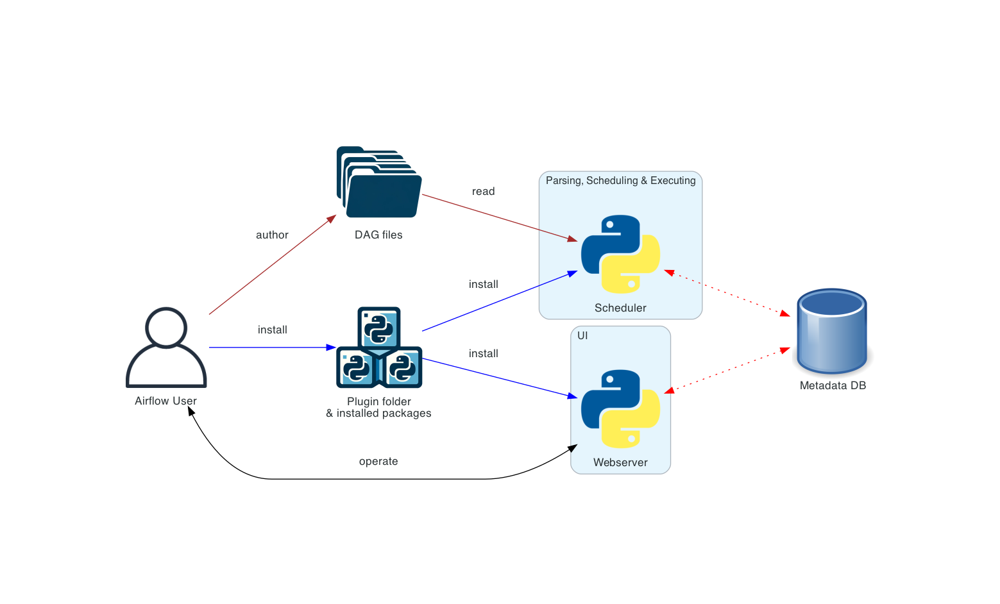

# Relatório de Estudos

**Nome do Estagiário:** Pablo Vinícius Domingues Sanches  
**Data:** 20/08/2024

**Módulos/Etapas Feitas:**  

[**1. Mensageria**](#msg)
<div style="font-size: 12px;">

- [**1.2 Pub/Sub**](#pub)
</div>

[**2. Linguagens e Frameworks**](#linguagens)  
<div style="font-size: 12px;">

- [**2.1 Apache Spark e Hive**](#spy)<br>
- [**2.2 Apache Kafka**](#kaf)<br>
- [**2.3 Apache Hadoop**](#had)<br>
- [**2.4 Apache Beam**](#beam)<br>
- [**2.5 Google Dataflow**](#dflow)<br>
- [**2.5 Apache Airflow**](#aflow)<br>
</div>
<br>

## Resumo dos módulos 

# **1. Mensageria <a id = "msg"></a>**
<div style="text-align: center;">
A mensageria é um conceito que se refere à troca de mensagens entre sistemas ou componentes de sistemas distribuídos.

<br>


<br>

Os conceitos presentes na mensageria formam a base do funcionamento da mensageria em sistemas distribuídos, permitindo a construção de aplicações robustas e escaláveis, capazes de lidar com a complexidade da comunicação entre componentes em ambientes dinâmicos.
</div>
<br>

- **Fila de Mensagens (Message Queue):** Intermediário onde mensagens são armazenadas até serem processadas.<br>


- **Produtor (Producer):** Componente que envia mensagens para a fila ou tópico.<br>


- **Consumidor (Consumer):** Componente que recebe e processa mensagens da fila ou tópico.<br>


- **Tópico (Topic):** Canal onde mensagens são publicadas e distribuídas para múltiplos assinantes.<br>


- **Broker de Mensagens (Message Broker):** Sistema que gerencia filas, tópicos, produtores e consumidores (e.g., RabbitMQ, Kafka).<br>


- **Persistência de Mensagens (Message Persistence):** Garantia de que mensagens são armazenadas de forma durável.<br>


- **Entrega Garantida (Guaranteed Delivery):** Garantia de que uma mensagem será entregue ao consumidor.<br>


- **Dead Letter Queue (DLQ):** Fila onde mensagens não processadas corretamente são enviadas para tratamento especial.<br>


- **Ordenação de Mensagens (Message Ordering):** Garantia de que mensagens são processadas na ordem de envio.<br>


- **Particionamento (Partitioning):** Distribuição de mensagens entre partições para escalabilidade (usado em Kafka).<br>
**☛ Apache Kafka:** é uma plataforma de streaming distribuída usada para construir pipelines de dados em tempo real e aplicativos de streaming. É projetada para lidar com grandes volumes de dados de forma rápida e confiável.

<br>

### **1.2 Pub/Sub<a id = "pub"></a>**
Em vez de enviar mensagens diretamente de um produtor para um consumidor específico (como em uma fila de mensagens), o modelo Pub/Sub permite que as mensagens sejam publicadas em um tópico e, em seguida, distribuídas para todos os consumidores que estão inscritos (assinantes) nesse tópico.<br>
O modelo Pub/Sub é essencial para sistemas que precisam de uma comunicação eficiente e escalável entre vários componentes, especialmente em arquiteturas de microserviços e ambientes de alta disponibilidade.
<div style="text-align: center;">

</div>
<br>

- **Produtor/Publicador (Publisher):**<br>
É o componente que envia (publica) mensagens para um tópico. Os publicadores não precisam saber quem está recebendo as mensagens, eles apenas publicam para um tópico específico.


- **Tópico (Topic):**<br>
Um canal onde as mensagens são publicadas. Todos os assinantes de um tópico recebem as mensagens publicadas nele. Um tópico pode ser visto como uma categoria ou um canal de comunicação, onde os publicadores enviam informações e os assinantes recebem as atualizações.

- **Consumidor/Assinante (Subscriber):**<br>
É o componente que se inscreve (assina) em um ou mais tópicos para receber mensagens. Quando uma mensagem é publicada em um tópico ao qual um assinante está inscrito, ele recebe a mensagem.

<br>

# **2. Frameworks <a id = "linguagens"></a>**
O termo framework refere-se a uma estrutura de suporte que fornece uma base para o desenvolvimento de aplicações, sistemas ou processos.

### **2.1 Apache Sparke e PySpark <a id = "spy"></a>**
Através do Zeppelin foi possível realizar algumas consultas na prática utilizando Spark e sua API PySpark. Assim como no módulo de BigQuery, aqui também foi utilizado o mesmo dataset do IMDb(IMDB Dataset of 50K Movie Reviews).
<div style="text-align: center;">

</div>

___
### **2.2 Apache Kafka <a id = "kaf"></a>**
Em resumo, O Apache Kafka é uma alternativa aos sistemas de mensageria empresariais tradicionais. Mas de forma geral, Apache Kafka é uma plataforma de streaming de eventos distribuída que é usada para construir pipelines de dados em tempo real e aplicativos de streaming. O Kafka foi projetado para lidar com grandes volumes de dados de forma escalável e tolerante a falhas, tornando-o ideal para casos de uso como análise em tempo real, ingestão de dados e arquiteturas orientadas a eventos.

<br>
<div style="text-align: center;">

</div>
<br>

Em sua essência, o Kafka é um sistema de mensagens de **publicação-assinatura (pub-sub)** distribuído. Os dados são gravados em tópicos do Kafka pelos produtores e consumidos desses tópicos pelos consumidores. Os tópicos do Kafka podem ser particionados, permitindo o processamento paralelo de dados, e os tópicos podem ser replicados em vários corretores para tolerância a falhas.

___
### **2.3 Apache Hadoop <a id = "had"></a>**
O Hadoop é um framework de código aberto baseado em Java que gerencia o armazenamento e o processamento de grandes quantidades de dados para aplicativos. O Hadoop usa armazenamento distribuído e processamento paralelo para lidar com jobs de **Big Data** e análise, dividindo as cargas de trabalho em cargas de trabalho menores que podem ser executadas ao mesmo tempo.

Quatro módulos compreendem o framework principal do Hadoop e funcionam coletivamente para formar o ecossistema Hadoop:

- **Hadoop Distributed File System (HDFS):** Um sistema de arquivos distribuído que armazena dados em grandes blocos e os distribui através de nós em um cluster. Isso garante alta disponibilidade e redundância de dados.

<br>

- **Yet Another Resource Negotiator (YARN):** o YARN é uma plataforma de gerenciamento de recursos responsável por gerenciar recursos de computação em clusters e usá-los para programar os aplicativos dos usuários. Ele realiza programação e alocação de recursos em todo o sistema Hadoop.

<br>

- **MapReduce:** Um modelo de programação e um mecanismo de processamento que permite processar e gerar grandes conjuntos de dados distribuídos de maneira eficiente. O trabalho é dividido em partes menores que podem ser processadas paralelamente em vários nós do cluster.

<br>

- **Hadoop Common:** o Hadoop Common inclui as bibliotecas e utilitários usados e compartilhados por outros módulos do Hadoop.

<br>
<div style="text-align: center;">

</div>
<br>

Além de HDFS, YARN e MapReduce, todo o ecossistema de código aberto Hadoop continua a crescer e inclui muitas ferramentas e aplicativos para ajudar a coletar, armazenar, processar, analisar e gerenciar Big Data. Eles incluem **Apache Pig, Apache Hive, Apache HBase, Apache Spark, Presto e Apache Zeppelin.**
<br>

### **2.3.1 Hive**
Apache Hive é uma ferramenta de data warehousing construída sobre o Hadoop. Ela permite que os usuários façam consultas e análises de grandes conjuntos de dados armazenados no HDFS utilizando uma linguagem semelhante ao SQL chamada **HiveQL (Hive Query Language)**. O Hive traduz as consultas HiveQL em jobs MapReduce, Apache Tez ou Apache Spark, dependendo da configuração do cluster.
<br>

**Em resumo:**<br>
- Hadoop é a plataforma base que oferece o armazenamento e o processamento distribuído de dados.<br>

- Hive é uma ferramenta que funciona sobre o Hadoop, oferecendo uma interface SQL para consultas e análises de dados grandes armazenados no HDFS.<br>

___
### **2.4 Apache Beam <a id = "beam"></a>**
O Apache Beam é um modelo de programação de código aberto para definir pipelines em lote (batch) e de streaming. Este modelo unifica diferentes engines de processamento de dados e SDKs (Software Development Kits) com base no modelo de Dataflow. O Apache Beam permite que os utilizadores expressem qualquer pipeline de dados numa linguagem familiar. 
<br>
<div style="text-align: center;">

</div>
<br>
Uma das grandes vantagens do Apache Beam é que ele permite que você escreva uma única pipeline que pode ser executada em diferentes back-ends de processamento de dados, conhecidos como runners. Isso significa que, ao usar Apache Beam, você pode migrar sua lógica de processamento entre diferentes motores sem ter que reescrever seu código. 

___
### **2.5 Google Dataflow <a id = "dflow"></a>**
O Dataflow é um serviço do Google Cloud que fornece processamento unificado de dados de stream e em lote em escala. Use o Dataflow para criar pipelines de dados que leiam uma ou mais fontes, transformem os dados e gravem os dados em um destino.
<br>
<div style="text-align: center;">

</div>
<br>
Ele foi projetado para fornecer uma abstração de alto nível que pode ser executada em diferentes motores de processamento, como Apache Flink, Apache Spark, Google Cloud Dataflow, entre outros.

<br> 

- **Pipeline:** Usando Apache Beam, você define a pipeline que especifica como os dados serão lidos, processados e gravados.

- **Execução no Dataflow:** A pipeline é implantada no Google Cloud Dataflow, onde o serviço gerencia a execução em um ambiente distribuído.

- **Monitoramento e Depuração:** Dataflow oferece ferramentas integradas para monitorar a execução das pipelines, incluindo visualização de métricas e logs, o que facilita a identificação de problemas e otimização da performance.

<br>

### **2.5.1 Apache Beam e Dataflow:**
No **Apache Beam** é onde vai ser usado o modelo de programação utilizado para definir as pipelines de dados. Ele possibilita  que escreva código onde pode ser executado em vários ambientes diferentes.<br>
Já o **Google Cloud Dataflow** é um dos ambientes onde se pode executar essas pipelines. Nele é implementado o modelo de programação do Apache Beam, fornecendo um serviço gerenciado que cuida de toda a complexidade operacional, como provisionamento de recursos, escalabilidade e monitoramento.

<br>

___
### **2.6 Apache Airflow <a id = "aflow"></a>**
Apache Airflow é uma plataforma de código aberto usada para criar, agendar e monitorar fluxos de trabalho, também conhecidos como **workflows**. Ele é amplamente utilizado para orquestrar tarefas que podem envolver processamento de dados, **ETL (extração, transformação e carga de dados)**, movimentação de dados entre sistemas, automação de processos, e muito mais.
<br>
<div style="text-align: center;">

</div>
<br>

A principal característica do Apache Airflow é a capacidade de definir, programar e monitorar fluxos de trabalho complexos, chamados de DAGs (Directed Acyclic Graphs). O Airflow foi construído para lidar com dependências entre tarefas e para gerenciar falhas, fornecendo mecanismos de retentativa e notificações de alerta.

As tarefas e suas dependências são definidas em Python, tornando-as mais flexíveis e acessíveis para Engenheiros e Arquitetos de Dados. Além disso, o Airflow oferece uma interface de usuário baseada na web para visualizar e gerenciar fluxos de trabalho, o que facilita o monitoramento e a depuração de problemas.

<br>

## Links de Laboratórios

- Get Started with Pub/Sub (https://www.cloudskillsboost.google/course_templates/728)


<br>

## **Recursos Utilizados:**  

- GitMind (https://gitmind.com/app/docs/mokn7z35)
- Dataset (https://www.kaggle.com/datasets/lakshmi25npathi/imdb-dataset-of-50k-movie-reviews)
- (https://www.sensedia.com.br/post/o-que-e-mensageria-tudo-o-que-voce-precisa-saber)
- (https://www.redhat.com/pt-br/topics/integration/what-is-apache-kafka)
- (https://docs.confluent.io/kafka/introduction.html)
- (https://cloud.google.com/learn/what-is-hadoop?hl=pt-BR)
- (https://cloud.google.com/dataflow/docs/overview?hl=pt-br)
- (https://blog.dsacademy.com.br/apache-airflow-caracteristicas-vantagens-e-desvantagens-no-cenario-da-engenharia-de-dados/)
- Minio
- Zeppelin
- VS Code
- Git & GitHub

<br>

## **Principais Comandos:**  
```python
%livy.pyspark
#Especificando:
df.select("Series_Title", "Released_Year", "IMDB_Rating", "Genre").show()
```

```python
%livy.pyspark
#Filtrando:
df.select("Series_Title", "Released_Year", "IMDB_Rating") \
  .filter(df["IMDB_Rating"] >= 7.9) \
  .show()
```

```python
%livy.pyspark
#Com ordem decrescente:
from pyspark.sql.functions import desc

df.select("Series_Title", "Released_Year", "IMDB_Rating") \
  .filter(df["IMDB_Rating"] >= 7.9) \
  .orderBy(desc("IMDB_Rating")) \
  .show()
```

```python
%livy.pyspark
#Com ordem crescente:
df.select("Series_Title", "Released_Year", "IMDB_Rating") \
  .filter(df["IMDB_Rating"] >= 7.9) \
  .orderBy("IMDB_Rating", ascending=True) \
  .show()
```

```python
%livy.pyspark
#Adicionando limite (Top 10 filmes da história)
df.select("Series_Title", "Released_Year", "IMDB_Rating") \
  .limit(10) \
  .show()
```

```python
%livy.pyspark
#Filmes por 'Christopher Nolan'
df.select("Series_Title", "Director", "Released_Year", "IMDB_Rating", "Genre") \
  .filter(df["Director"] == "Christopher Nolan") \
  .orderBy("Released_Year", ascending=True) \
  .show()
```

```python
%livy.pyspark
#Selecionando o fimlme mais antigo do dataset:
df.select("Series_Title", "Director", "Released_Year", "IMDB_Rating", "Genre") \
  .orderBy("Released_Year", ascending=True) \
  .limit(1) \
  .show()
```

```python
%livy.pyspark
#Descobrindo o filme mais recente do dataset:
from pyspark.sql.functions import desc

df.select("Series_Title", "Released_Year", "IMDB_Rating") \
  .orderBy(desc("Released_Year")) \
  .limit(5) \
  .show()
```

<br>

**Desafios Encontrados:**  
Acredito que o único e breve desafio encontrado foi alinhar quais seriam as prioridades dos temas de estudos.

**Feedback e Ajustes:**  
Com o fim do período de estudo, posso dizer que foi possível adquirir bastante conhecimento e absorver muitos conteúdos. Mas faltou direcionamento para práticas dos módulos.

**Próximos Passos:**  
Todos relatórios foram finalizados.
