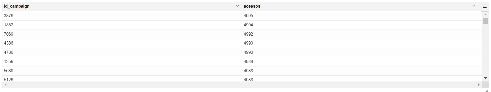
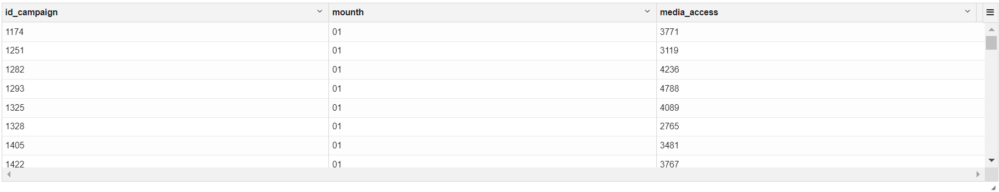
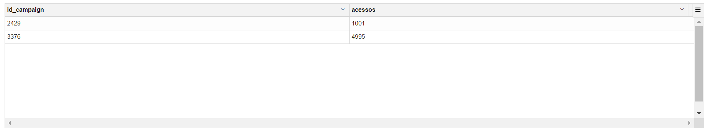
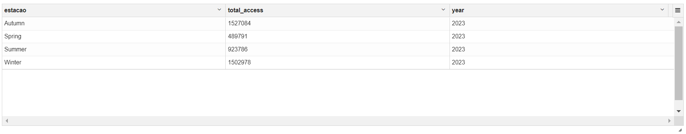
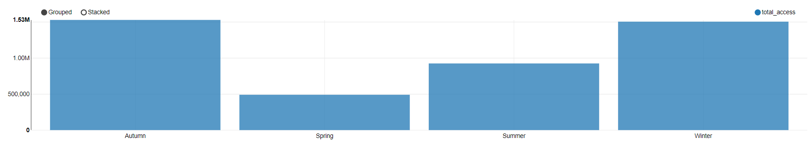

**Nome do Estagiário:** Pablo Vinícius Domingues Sanches  
**Data:** 27/08/2024

<br>

# Consultas com Hive (HiveQL)

```sql
%hive

-- Quantos acessos cada campanha obteve ao longo do ano?

SELECT 
    id_campaign, 
    COUNT(client_id) AS acessos
FROM 
    query
GROUP BY 
    id_campaign
ORDER BY
    acessos DESC
```
<div style="text-align: center;">

</div>
<br>

- **AS:** É usada para dar um **alias** (um nome alternativo) a colunas ou tabelas; <br>
- **COUNT:** É uma função de agregação que conta o número de linhas em um conjunto de resultados; <br>
- **GROUP BY:** Agrupa resultados com base em uma ou mais colunas, permitindo o uso de funções de **agregação**;<br>
- **ORDER BY:** Ordena os resultados de uma consulta.

<br>

```sql
%hive

-- Qual foi a média de acessos por campanha por mês?

SELECT -- consultando externamente:
    id_campaign,
    mounth, -- coluna cuja foi definida na subconsulta interna. A consulta externa seleciona essa coluna para ser exibida nos resultados finais.
    ROUND(AVG(total_access), 0) AS media_access
FROM (
    SELECT
        id_campaign,
        SUBSTRING(data_campaign, 6, 2) AS mounth, -- coluna que foi definida
        COUNT(client_id) AS total_access
    FROM
        query
    GROUP BY
        id_campaign,
        SUBSTRING(data_campaign, 6, 2)) AS monthly_access
GROUP BY
    id_campaign,
    mounth
ORDER BY
    mounth,
     id_campaign
```
<br>
<div style="text-align: center;">

</div>
<br>

- **ROUND:** A função `ROUND` é usada para arredondar um número para um número específico de casas decimais.<br><br>

- **AVG:** A função `AVG` calcula a média de um conjunto de valores. É frequentemente utilizada em consultas de agregação.<br><br>

- **SUBSTRING:**  A função `SUBSTRING` extrai uma parte de uma string, começando em uma posição específica e com um comprimento determinado.<br><br>

- **Consulta Externa:** As consultas externas são aquelas que são executadas diretamente no nível do banco de dados. Elas podem incluir operações como `SELECT`, `INSERT`, `UPDATE` e `DELETE`. Essas consultas interagem diretamente com as tabelas e retornam resultados.<br><br>

- **Consulta Interna (Subconsulta):** Subconsultas são consultas aninhadas dentro de outra consulta. Elas podem ser usadas em cláusulas `SELECT, FROM ou WHERE`. 

<br>

```sql
%hive
-- Identifique as campanhas com o maior e o menor número de acessos.

SELECT
    id_campaign,
    acessos
FROM (
    SELECT 
        id_campaign, 
        COUNT(client_id) AS acessos
    FROM 
        query
    GROUP BY 
        id_campaign
) AS campaign_access_counts
WHERE acessos = (SELECT MAX(acessos)
                 FROM (
                     SELECT COUNT(client_id) AS acessos
                     FROM query
                     GROUP BY id_campaign
                 ) AS max_acessos)
   OR acessos = (SELECT MIN(acessos)
                 FROM (
                     SELECT COUNT(client_id) AS acessos
                     FROM query
                     GROUP BY id_campaign
                 ) AS min_acessos)
```

<div style="text-align: center;">

</div>
<br>

- **WHERE:** A cláusula `WHERE` é usada para filtrar registros com base em condições específicas. <br><br>

- **MAX:** A função `MAX` é uma função de agregação que retorna o maior valor de uma coluna numérica ou de data em um conjunto de resultados.<br><br>

- **MIN:**  A função `MIN` é semelhante à função MAX, mas retorna o menor valor de uma coluna numérica ou de data.<br><br>

- **OR:** O operador `OR` é usado em condições WHERE para combinar múltiplas condições. Se uma das condições for verdadeira, a linha será incluída nos resultados.<br><br>

<br>

```sql
%hive

-- Filtando por períodos(estações climáticas) do ano para identificar sazonalidades nos dados:


SELECT
    CASE ---->CASE: Inicia a estrutura condicional  --->WHEN: Define uma condição a ser avaliada(if-else)
    
        WHEN SUBSTRING(data_campaign, 6, 2) IN ('12', '01', '02') THEN 'Summer' --Verão
        WHEN SUBSTRING(data_campaign, 6, 2) IN ('03', '04', '05') THEN 'Autumn' --Outono
        WHEN SUBSTRING(data_campaign, 6, 2) IN ('06', '07', '08') THEN 'Winter' --Inverno
        WHEN SUBSTRING(data_campaign, 6, 2) IN ('09', '10', '11') THEN 'Spring' --Primavra
    END AS estacao, -- Determina como estação do ano
    COUNT(client_id) AS total_access,
    SUBSTRING(data_campaign, 1, 4) AS year
FROM
    query
GROUP BY
    CASE 
        WHEN SUBSTRING(data_campaign, 6, 2) IN ('12', '01', '02') THEN 'Summer'
        WHEN SUBSTRING(data_campaign, 6, 2) IN ('03', '04', '05') THEN 'Autumn'
        WHEN SUBSTRING(data_campaign, 6, 2) IN ('06', '07', '08') THEN 'Winter'
        WHEN SUBSTRING(data_campaign, 6, 2) IN ('09', '10', '11') THEN 'Spring'
    END,
    SUBSTRING(data_campaign, 1, 4)    
ORDER BY
    year, estacao

```
<div style="text-align: center;">

</div>
<br>

<div style="text-align: center;">

</div>
<br>

- **CASE:** A expressão `CASE` é usada para realizar lógica condicional em consultas SQL. Ela permite que você execute diferentes ações com base em condições específicas, semelhante a uma estrutura de `"if-else"`. <br><br>

- **WHEN IN THEN:** A cláusula `WHEN` é usada dentro da expressão CASE para definir as condições que serão testadas.<br><br>

- **IN:** O operador `IN` é usado para verificar se um valor está presente em uma lista de valores. <br><br>

- **THEN:** A cláusula `THEN` é usada após cada condição WHEN na expressão CASE para especificar o valor a ser retornado se a condição for verdadeira.<br><br>

- **END AS:**  A cláusula `END` é usada para finalizar a expressão CASE. O `AS` é utilizado para dar um alias ao resultado da expressão, permitindo que você nomeie a coluna resultante.<br><br>

