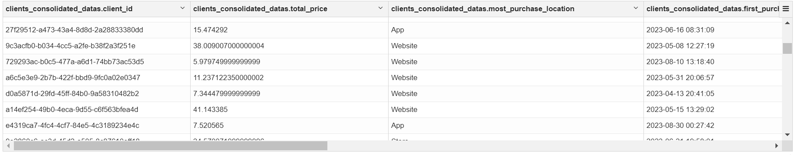
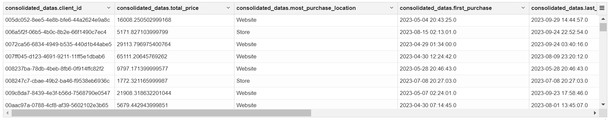

**Nome do Estagiário:** Pablo Vinícius Domingues Sanches  
**Data:** 30/08/2024

<br>

# **Consultas com Hive (HiveQL) - Tarefa 2**
Para as consultas das necessidades informadas, foram utilizados dois métodos. O Primeiro método consiste na criação de várias tabelas(não incluindo os datasets), sendo a última a tabela, uma tabela de consolidação que vai unir as informações de todas as outras, assim como adicionar informações novas. Já o segundo método, ao contrário do primeiro, neste aqui as informações e buscas foram adicionadas em uma única tabela.
<br><br>

## **Criação de Tabelas (Hive)**
 É necessario  especificar o tipo de váriavel para cada uma das colunas presentes no dataset, para que asssim então, prossiga à importação do dados. A criação das duas tabelas seguiu a lógica de comando utilizada foi esta abaixo:

```sql
%hive
CREATE TABLE IF NOT EXISTS campaign (  
  id INT,
  id_campaign INT,
  type_campaign STRING,
  days_valid INT,
  data_campaign TIMESTAMP,
  channel STRING,
  return_status STRING,
  return_date TIMESTAMP,
  client_id STRING
)

ROW FORMAT DELIMITED
FIELDS TERMINATED BY ','
STORED AS TEXTFILE
TBLPROPERTIES ("skip.header.line.count"="1")
```

## **Importação de Dados (Minio ⭢ Hive)**

```sql
%hive

LOAD DATA INPATH 's3a://tarefa02/campaigns_2023_hist.csv' -- Caminho de arquivo no bucket criado no Minio --
INTO TABLE campaign
```

<br><br>

# **Método 1**

### - ***Tabela de Gastos Totais por Cliente***

```sql
%hive

CREATE VIEW IF NOT EXISTS client_total_spent AS
SELECT 
    client_id,
    SUM(price * amount * (1 - COALESCE(discount_applied, 0))) AS total_price
FROM 
    purchase
GROUP BY 
    client_id
```
<br>

- `CREATE VIEW`: Uma view (visão) é uma tabela virtual que é baseada no resultado de uma consulta SQL. Ela não armazena dados fisicamente, mas fornece uma maneira de simplificar o acesso a dados complexos ou de restringir o acesso a dados sensíveis.<br><br>
- `COALESCE`: Utilizada para retornar o primeiro valor não nulo em uma lista de expressões. Ela avalia cada expressão na ordem em que são fornecidas e retorna o primeiro valor que não é nulo. 

----------

### - ***Tabela de Local mais Utilizado pelo Cliente***

```sql
%hive
CREATE VIEW IF NOT EXISTS client_most_frequent_location AS
SELECT 
    client_id, 
    purchase_location AS most_purchase_location
FROM (
    SELECT 
        client_id, 
        purchase_location, 
        ROW_NUMBER() OVER (PARTITION BY client_id ORDER BY COUNT(*) DESC) AS rn
    FROM 
        purchase
    GROUP BY 
        client_id, purchase_location
) sub
WHERE rn = 1
```
<br>

- `ROW_NUMBER`: É uma função de janela (window function) que atribui um número sequencial único a cada linha dentro de um grupo de linhas. A numeração começa em 1 para cada conjunto de linhas.<br><br>
- `OVER`: A cláusula OVER define o escopo ou contexto da função de janela. Ela especifica como as linhas são divididas e ordenadas para a aplicação da função de janela.<br><br>
- `PARTITION BY`: É usado dentro da cláusula OVER para dividir o conjunto de resultados em partições (subconjuntos) que têm algo em comum. Cada partição é tratada separadamente pela função de janela.<br><br>
- `sub`: Alias que permite referenciar os resultados da subconsulta de forma organizada e clara na consulta externa. Sem o alias, a consulta externa não teria uma maneira fácil de referenciar o conjunto de dados gerado pela subconsulta.<br><br>
- ` WHERE rn = 1`: Filtra os resultados para pegar apenas o local de compra com o maior número de compras para cada cliente (ou seja, onde o número de linha é 1).<br><br>
---------

### - ***Tabela de Primeira e Última Compra por Cliente***

```sql
%hive

CREATE VIEW IF NOT EXISTS client_first_last_purchase AS
SELECT 
    client_id,
    MIN(purchase_datetime) AS first_,
    MAX(purchase_datetime) AS last_
FROM 
    purchase
GROUP BY 
    client_id

```
---------
### - ***Tabela de Campanha Mais Recebida pelo Cliente***

```sql
%hive
CREATE VIEW IF NOT EXISTS client_most_frequent_campaign AS
SELECT 
    client_id, 
    type_campaign AS most_campaign
FROM (
    SELECT 
        client_id, 
        type_campaign, 
        ROW_NUMBER() OVER (PARTITION BY client_id ORDER BY COUNT(*) DESC) AS rn
    FROM 
        campaign
    GROUP BY 
        client_id, type_campaign
) sub
WHERE rn = 1
```

----------
### - ***Tabela de Quantidade de Status "error" para o liente.***

```sql
 %hive
CREATE VIEW IF NOT EXISTS client_campaign_errors AS
SELECT 
    client_id,
    SUM(CASE WHEN return_status = 'error' THEN 1 ELSE 0 END) AS quantity_error
FROM 
    campaign
GROUP BY 
    client_id   
```
<br>

- `CASE`:  É uma estrutura condicional que funciona como uma instrução if-else. Ela avalia uma ou mais condições e retorna valores específicos com base nessas condições.<br><br>
- `WHEN`:  É usado para definir a condição que deve ser avaliada. Se a condição for verdadeira, o SQL executa a ação associada ao THEN. <br><br>
- `THEN`:  Especifica o resultado ou valor a ser retornado quando a condição correspondente WHEN é verdadeira.<br><br>
- `ELSE`: Define o valor a ser retornado caso nenhuma das condições WHEN sejam verdadeiras. Este é opcional e, se omitido, o CASE retorna NULL quando nenhuma condição é satisfeita.<br><br>
- `END`: Fecha a estrutura CASE e é obrigatório. Ele indica o final da expressão condicional.<br><br>

----------
### - ***Tabela Consolidada(Conjunto unido das tabelas).***

```sql
%hive
CREATE VIEW IF NOT EXISTS clients_consolidated_datas AS
SELECT 
    sp.client_id,
    COALESCE(sp.total_price, 0) AS total_price,  
    COALESCE(loc.most_purchase_location, 'N/A') AS most_purchase_location,  
    COALESCE(fl.first_, '1970-01-01 00:00:00') AS first_purchase,  
    COALESCE(fl.last_, '1970-01-01 00:00:00') AS last_purchase,  
    COALESCE(camp.most_campaign, 'N/A') AS most_campaign, 
    COALESCE(err.quantity_error, 0) AS quantity_error,  
    DATE_FORMAT(CURRENT_DATE, 'yyyy-MM-dd') AS date_today,  
    CAST(DATE_FORMAT(CURRENT_DATE, 'MMyyyy') AS INT) AS anomes_today  df
FROM 
    client_total_spent sp
LEFT JOIN 
    client_most_frequent_location loc ON sp.client_id = loc.client_id
INNER JOIN 
    client_most_frequent_campaign camp ON sp.client_id = camp.client_id
INNER JOIN 
    client_campaign_errors err ON sp.client_id = err.client_id
LEFT JOIN 
    client_first_last_purchase fl ON sp.client_id = fl.client_id
```

<div style="text-align: center;">

</div>
<br>

- `DATE_FORMAT`: Função utilizada para formatar datas em um formato específico.<br><br>
- `CURRENT_DATE`: Função que retorna a data atual do sistema.<br><br>
- `CAST`: Usado para converter um valor de um tipo de dado para outro. Necessário quando se deseja mudar o tipo de dado, por exemplo, de string para inteiro, ou de timestamp para date. <br><br> 
- `AS INT`: É uma parte do CAST que especifica o tipo de dado para o qual o valor deve ser convertido.<br><br>
- `INNER JOIN`: Cláusula que combina linhas de duas ou mais tabelas com base em uma condição de correspondência entre colunas. <br><br>
```sql
-- Exemplo:
SELECT *
FROM table1
INNER JOIN table2
ON table1.column = table2.column --> Apenas as linhas que têm valores correspondentes nas colunas especificadas serão incluídas no resultado.
```

- `LEFT JOIN`: Cláusula que retorna todas as linhas da tabela à esquerda (primeira tabela mencionada) e as linhas correspondentes da tabela à direita (segunda tabela mencionada). Se não houver correspondência, os resultados da tabela da direita serão NULL. <br><br>
- `ON`: Cláusula usada em conjunto com JOIN (seja INNER JOIN, LEFT JOIN, etc.) para definir a condição de correspondência entre as tabelas.<br>Em suma, ela especifica como as tabelas estão relacionadas através das colunas.<br><br>

<br>
<br>

# **Método 2**

### - ***Tabela Consolidada(Tabela Única).***

Para trazer todos esses dados, a consulta faz uso de várias junções LEFT JOIN, que asseguram que todos os clientes presentes na tabela principal de compras (purchases) sejam incluídos, mesmo que não haja correspondências completas nas tabelas de localização ou campanha.

```sql
%hive

CREATE VIEW consolidated_datas AS
SELECT
    p.client_id,
    
    --> Total gasto pelo cliente
    SUM(p.price * p.amount * (1 - p.discount_applied)) AS total_price,
    
    --> Local de compra mais frequente para compras
    MAX(location_most_frequent) AS most_purchase_location,
    
    --> Data de primeira e última compra
    MIN(p.purchase_datetime) AS first_purchase,
    MAX(p.purchase_datetime) AS last_purchase,
    
    --> Campanha mais recebida
    MAX(campaign_most_frequent) AS most_campaign,
    
    --> Quantidade de campanhas com status "error"
    SUM(CASE WHEN c.return_status = 'error' THEN 1 ELSE 0 END) AS quantity_error,

    --> Data atual e o ano e mês atual formatados
    CURRENT_DATE AS date_today,
    CONCAT(FORMAT_NUMBER(YEAR(CURRENT_DATE), '0000'), FORMAT_NUMBER(MONTH(CURRENT_DATE), '00')) AS anomes_today

FROM
    purchases p
LEFT JOIN
    campaign c
ON
    p.client_id = c.client_id

LEFT JOIN (
    SELECT
        client_id,
        MAX(purchase_location) AS location_most_frequent
    FROM (
        SELECT
            client_id,
            purchase_location,
            COUNT(*) AS freq
        FROM purchases
        GROUP BY client_id, purchase_location
    ) freq_table
    GROUP BY client_id
) location_table
ON p.client_id = location_table.client_id

LEFT JOIN (
    SELECT
        client_id,
        MAX(id_campaign) AS campaign_most_frequent
    FROM (
        SELECT
            client_id,
            id_campaign,
            COUNT(*) AS freq
        FROM campaign
        GROUP BY client_id, id_campaign
    ) campaign_table
    GROUP BY client_id
) campaign_table
ON p.client_id = campaign_table.client_id

GROUP BY
    p.client_id
```

<div style="text-align: center;">

</div>
